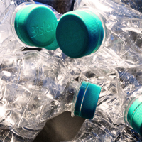

<!-- PROJECT LOGO -->
 

  

  <h3 align="center">A Bottles</h3>

  

    We manufacture bottles!
     
    <a href="https://github.com/mehta-asim/Mehta_Asim_FIP_Fall2020"><strong>Explore the docs »</strong></a>
     
     
    <a href="https://github.com/mehta-asim/Mehta_Asim_FIP_Fall2020">View Demo</a>
    ·
    <a href="https://github.com/mehta-asim/Mehta_Asim_FIP_Fall2020/issues">Report Bug</a>
    ·
    <a href="https://github.com/mehta-asim/Mehta_Asim_FIP_Fall2020/issues">Request Feature</a>
  

<!-- TABLE OF CONTENTS -->

  
<h2 style="display: inline-block">Table of Contents</h2>

  <ol>
    <li>
      <a href="#about-the-project">About The Project</a>
      <ul>
        <li><a href="#built-with">Built With</a></li>
      </ul>
    </li>
    <li>
      <a href="#getting-started">Getting Started</a>
      <ul>
        <li><a href="#prerequisites">Prerequisites</a></li>
        <li><a href="#installation">Installation</a></li>
      </ul>
    </li>
    <li><a href="#usage">Usage</a></li>
    <li><a href="#roadmap">Roadmap</a></li>
    <li><a href="#license">License</a></li>
    <li><a href="#contact">Contact</a></li>
  </ol>

<!-- ABOUT THE PROJECT -->
## About The Project

This project is about developing an online presence for the A Bottles brand! 
 
It focuses on the different activities the brand engages in. 

 
One of the important parts is the showcase of the various products that the brand has to offer 

### Built With

* [HTML 5](https://www.w3.org/TR/2008/WD-html5-20080122/)
* [CSS](https://www.w3.org/Style/CSS/Overview.en.html)
* [Flexbox](https://www.w3.org/TR/css-flexbox-1/#intro)

<!-- GETTING STARTED -->
## Getting Started

To get a local copy up and running follow these simple steps.

### Prerequisites

There are 2 things that you require for smooth functioning and viewing of the project 
<ul>
  <li>Web Browser</li>
  <li>Code Editor</li>
</ul>

### Installation

* [1.Install any Web Browser](https://www.google.com/search?q=download-web-browser)

* [2. Install any Code Editor](https://www.google.com/search?q=download-code-editor)

<!-- USAGE EXAMPLES -->
## Usage

After installation, you open the <code>index.html</code> in a web browser to view the webpage.

If you want to change something you can use the code editor to open any file and make the necessary changes.

_For more literature, please refer to the [Documentation](https://www.w3schools.com/html/html_editors.asp)_

<!-- ROADMAP -->
## Roadmap

See the [open issues](https://github.com/mehta-asim/Mehta_Asim_FIP_Fall2020/issues) for a list of proposed features (and known issues).

<!-- LICENSE -->
## License

Distributed under the MIT License. See `LICENSE` for more information.

<!-- CONTACT -->
## Contact
Asim Mehta 
Project Link: [https://github.com/mehta-asim/Mehta_Asim_FIP_Fall2020](https://github.com/mehta-asim/Mehta_Asim_FIP_Fall2020)
